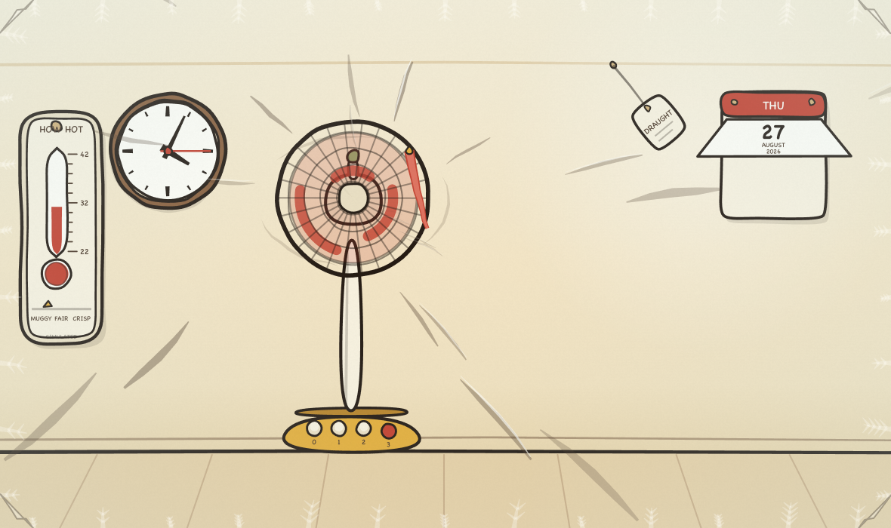
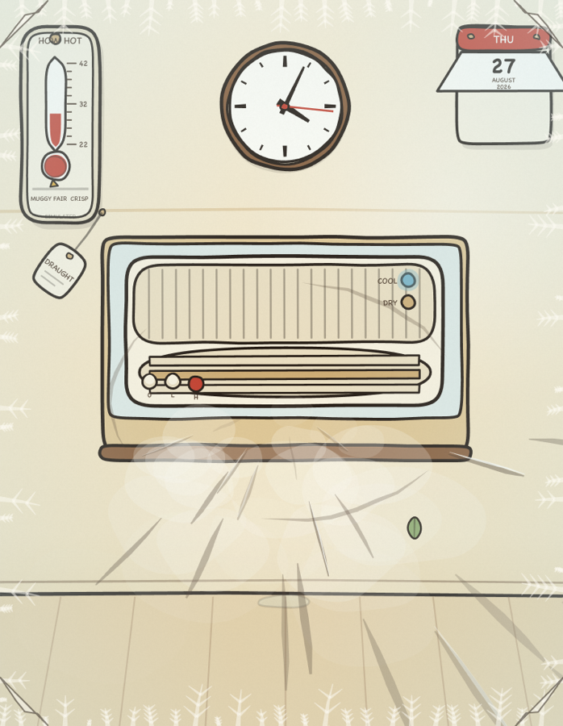

# CyberFan

**▶ [Open it](https://renrenmimi.github.io/cyberfann/)** — runs in your browser, nothing to install.

It has been extremely hot. This is a small department of imaginary cooling: four
appliances drawn in the flat, inked, gouache-painted style of a 1940s cartoon, with
working gears, and every sound built at runtime out of oscillators and filtered
noise. There are no audio files and no images in this repository — the drawing is
code and so is the sound.

*The wide scene. Clock and calendar read the visitor's own local time.*

## Controls

| Action | |
|---|---|
| Pick an appliance | `1`–`4`, click a tab, or arrow through the strip |
| Change speed | `↑` `↓`, or press a key on the plate |
| On / off | `Space` |
| Let the head swing | `P`, or pull the pin — fan only |
| Hot / cold, cool / dry | `H`, or flip the switch — dryer and A/C |
| Mute | `M`, or the speaker key |
| Fan by hand | click or drag the stage — palm-leaf fan |
| Volume | drag, scroll or arrow the knob |

Nothing makes a sound until you click, because that is the browser's rule. Headphones
help; a lot of this sits below 100 Hz.

## The wind blows at you, not past you

The first version had every appliance in profile, blowing to the right, and it read as
watching someone else get cooled off. So the outlets were turned to face the lens and
the air was rebuilt around one rule: **something approaching you at a constant speed
covers more of your view every frame.** Each streak leaves the outlet radially,
accelerates as its radius grows, and gets longer and fatter on the way — then leaves
frame past your head.

Three things corroborate it, because a single cue is easy to disbelieve:

- **Swirl.** A rotor throws air outward *and around*, so each streak's angle drifts as
  it travels and the spray curves. Without this the streaks read as sunbeams.
- **Broken blast arcs.** Expanding rings drawn as two or three tapered segments with
  gaps — a closed ellipse reads as a circle somebody drew on the wall.
- **Paper that reacts.** The calendar's bottom sheet lifts *toward* the camera and
  widens as it lifts, and a draught tag on the wall leans away from whichever outlet is
  running. Two pieces of paper settle the question of which way the air is going.

The camera is in the room, so gusts knock it about. The frost and the film grain are on
the lens instead, and deliberately do not move with it.

## The information wall

Three objects, one composition, no dashboard:

- **A school-room enamel clock** whose hands are the visitor's own local time. The
  seconds hand ticks. Hours and minutes are read straight from `Date` on the frame that
  draws them, so the hands need no timer at all.
- **A tear-off calendar** showing today, formatted with `Intl.DateTimeFormat` in the
  visitor's locale. Only a day or minute rollover reformats anything; a 15-second
  interval watches for one and is cleared on `pagehide` and whenever the tab is hidden.
- **A thermometer with a comfort strip.** Both readings are invented by the page and the
  plaque is stamped **SIMULATED**. The temperature is a function of how long something
  has been running; the humidity only moves for the air conditioner, because a fan does
  not take water out of the air. The temperature also appears as `you feel` on the
  plate, and the humidity as its own chip.

## What is in it

- **One synth, four patches.** Three noise paths — broadband air, a resonant peak, a low
  rumble — plus five harmonic partials and a sawtooth for motor whine. What makes a hair
  dryer sound different from a window unit is a table of numbers, not different code.
- **Blade-pass frequency is computed, not chosen.** `rpm ÷ 60 × blades` sets the
  partials, so pitch follows the gear because the geometry says it must. Four blades at
  620 rpm land on 41 Hz; eleven at 9,000 land on 1,650.
- **Spin-up and coast-down are asymmetric.** A motor is driven up and then left to coast,
  so every appliance carries two time constants: 0.50 s and 0.80 s for the dryer, 2.0 and
  3.6 for the air conditioner. The plate names the phase it is in — *starting*,
  *running*, *speeding up*, *easing off*, *stopping* — derived from the level rather than
  stored, so it cannot disagree with the picture.
- **The ink line boils.** Golden-age cartoons were shot on twos — twelve new drawings a
  second. Motion runs at 60, but every outline is re-wobbled only twelve times a second,
  so the line crawls the way a hand-inked one does. The film grain re-seeds on the same
  clock.
- **Squash and stretch.** Bodies shake and pulse with the speed, and the two scale
  factors multiply to one, so a thing keeps its volume the way a drawn character does.
- **Transients are synthesized too.** A key's clack is a filtered noise burst plus a
  decaying tick. The palm fan has no motor to hold a tone, so each swing fires its own
  burst through a band-pass that sweeps up and back down — a whoosh is a filter moving,
  not a sample.
- **The compressor runs its own clock.** It cuts in and out on a timer, shoves the box
  sideways when it starts, takes the bottom of the spectrum with it when it stops, and
  drips into a puddle that slowly evaporates.
- **A ribbon tied to the cage**, eight verlet points with a length constraint, simulated
  on the fixed step rather than in the paint pass. It is the cheapest thing on the page
  that makes wind look real, because it lags.

## The narrow scene is a different drawing

Below 680 px of stage width the canvas becomes 760 × 980 and `relayout()` re-places every
object: the wall furniture spreads across the top, the appliance moves to the middle, the
floor drops. It is a portrait framing of the same room, not the landscape composition
scaled down — that used to collapse into a 328 × 199 letterbox.

## Tech

Canvas 2D and the Web Audio API. No runtime dependencies, no build step, one HTML file.

The simulation runs on a fixed 120 Hz step and the renderer takes whatever frame rate it
gets — integrating the raw frame delta instead would make a fan spin up slower on a slow
machine, which is the one thing a spin-up time must not do. Audio parameters are re-aimed
every frame with `setTargetAtTime`, which behaves as a one-pole follower: the same
smoothing a motor changing speed already has. The graph is built once, on the first real
gesture, and never rebuilt — which is what lets one appliance coast down while the next
spins up instead of clicking. `resume()` is retried on every later gesture, so there is no
silent-and-no-error state, and `M` mutes the master.

Layout is one block of tokens — spacing, control size, border, radius, shadow, type,
timing — and every rule measures itself against them. The plate is a named grid with
fixed slots: a control that does not apply to the current appliance is **disabled where it
stands** rather than removed, so switching appliances never moves anything. Chrome is DOM,
not canvas, so the keys, pin, switch, knob and mute are real buttons with real focus rings
and keyboard handling; tab artwork is grouped inline SVG.

`prefers-reduced-motion` reaches the drawing as well as the stylesheet: the ink stops
boiling, the camera stops being knocked about, bodies stop shaking, the seconds hand is
withdrawn and the particle budget is cut. Every state is carried by shape or text as well
as colour — the depressed key prints a dot, the selected tab draws a rule, the disabled
control is hatched.

## Verification

Two suites, both runnable without a browser harness.

`node verify.mjs` reads the appliance table and the level integration straight out of
`index.html` — not a copy — and runs **113 checks**: every appliance has an icon and a
render branch, gear levels ascend to full throttle, every frequency sweep starts above
zero, rpm leaves zero continuously and rises monotonically, blade-pass partials stay
inside the audible band, the summed gain of all voices leaves the limiter headroom, a
two-position switch has a second cooling figure to switch to, coast-down outlasts spin-up
everywhere, and each gear reaches 95 % of its target in the 3τ its time constant promises.

`index.html?selftest=1` runs **22 assertions** against the live DOM and prints a report.
Nothing is exposed on `window` and nothing runs without the flag. It covers what a
screenshot cannot: no page overflow, no clipped control label, no sub-44 px button, one
layout box for all four tabs, identical plate geometry across appliances, every key
agreeing with both the model and the readout, inapplicable controls disabled rather than
removed, keyboard operation, accessible names, a roving tab index, the calendar matching
today, the clock text refreshing on a minute rollover, a day rollover, interval cleanup,
the reduced-motion particle cap and camera stilling, and every appliance spinning up,
running and coasting to a stop.

Measured green at **320, 360, 390, 720** (which is 1440 at 200 % browser zoom), **768,
1024 and 1440** px.

---

© 2026 Weiren Feng. All rights reserved.
Published for reading and portfolio purposes; not licensed for reuse, modification, or redistribution.
