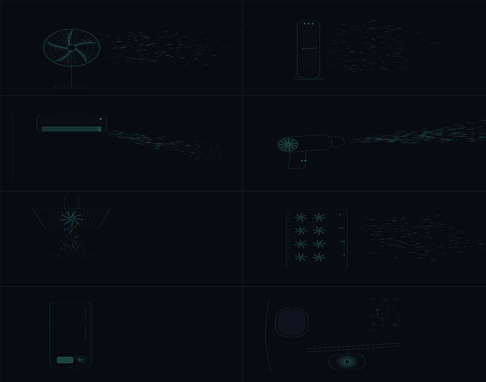

# CyberFan

**▶ [Open it](https://renrenmimi.github.io/cyberfan/)** — runs in your browser, nothing to install.

It has been extremely hot. This is a rack of eight cooling appliances you can switch
between and change gears on, and every sound they make is built at runtime out of
oscillators and filtered noise. There are no audio files in this repository.

*Desk fan, tower fan, air conditioner, hair dryer, range hood, server rack, refrigerator, aircraft cabin*

## Controls

| Action | Keys |
|---|---|
| Pick an appliance | `1`–`8`, or click the list |
| Change gear | `↑` `↓`, or click a gear |
| On / off | `Space` |
| Oscillate | `O` — on the two fans and the air conditioner |
| Heat | `H` — hair dryer only |

Headphones help. A lot of this sits below 100 Hz.

## What is in it

- **One synth, eight patches.** Three noise paths — broadband air, a resonant peak, a
  low rumble — plus five harmonic partials and one sawtooth for motor whine. What makes
  a hair dryer sound different from an air conditioner is entirely a table of numbers.
- **Blade-pass frequency is computed, not chosen.** `rpm ÷ 60 × blades` sets the tonal
  partials, so the pitch follows the gear because the geometry says it has to. Five
  blades at 640 rpm land on 53 Hz; a hair dryer's eleven blades at 9,000 rpm land on 1,650.
- **Spin-up and coast-down are asymmetric.** A motor is driven up and then left to
  coast, so every appliance has two time constants. The hair dryer reaches speed in
  0.55 s and the aircraft engine takes 3.5 — that difference is most of what makes a
  big machine sound big.
- **One level drives everything.** Filter cutoffs, gains, rotor speed, airflow, and the
  temperature readout all read the same `0…1` number, so the picture cannot drift out
  of step with the sound.
- **The compressor cycles on its own.** The air conditioner and the refrigerator run a
  timer that cuts the compressor in and out and takes the bottom of the spectrum with
  it; the blower keeps going.
- **Four rack fans that never agree.** A second partial bank runs 4.5 Hz off the first,
  and the interference between them is the slow throb you hear — and, at eight rotors
  drawn at slightly different rates, the throb you can see.
- **Stroboscopic aliasing is left in.** Rotors are drawn at their true angle every
  frame, so at high rpm they stall or run backwards against the refresh rate, the same
  way a real fan does on camera.
- **Filtered air, not sprites.** Streaks are emitted at the outlet, pick up turbulence
  the further they travel, and are pulled toward the centreline on the range hood
  because an intake sucks rather than blows.
- **A placebo thermometer.** It reads 34 °C, walks down while something is running, and
  goes back up when you switch it off. Nothing is measured, and the page says so. The
  hair dryer's heat switch sends it the other way; the refrigerator barely helps, which
  is thermodynamically correct.

## Tech

Canvas 2D and the Web Audio API, no runtime dependencies, one HTML file. The simulation
runs on a fixed 120 Hz timestep decoupled from the render loop, so a slow frame does not
change how long a fan takes to spin up. Audio parameters are re-aimed every frame with
`setTargetAtTime`, which behaves as a one-pole follower — the same smoothing a motor
changing speed already has.

The graph is built once on the first click and never rebuilt, which is what lets one
appliance coast down while the next spins up instead of clicking.

## Verification

`node verify.mjs` reads the appliance table and the level integration straight out of
`index.html` — not a copy — and runs 173 checks: gear levels ascend to full throttle,
every frequency sweep starts above zero, rpm leaves zero continuously and rises
monotonically, blade-pass partials stay inside the audible band, the summed gain of all
voices leaves the limiter headroom, coast-down outlasts spin-up on every device, and
each gear reaches 95 % of its target in the 3τ the time constant promises.

---

© 2026 Weiren Feng. All rights reserved.
Published for reading and portfolio purposes; not licensed for reuse, modification, or redistribution.
